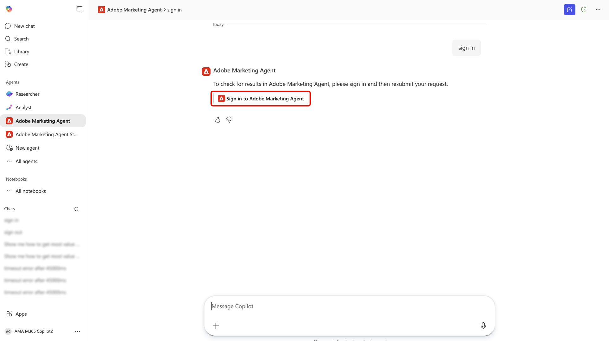

# [!DNL Microsoft 365 Copilot]에 대한 Adobe Marketing Agent

[!DNL Microsoft 365 Copilot]용 Adobe Marketing Agent은 Adobe Experience Platform을 [!DNL Microsoft 365 Copilot]에 직접 연결하는 AI 기반 도구입니다. 이 에이전트를 사용하면 [!DNL Teams], [!DNL Word], [!DNL Powerpoint] 및 [!DNL Excel]과(와) 같은 [!DNL Microsoft 365] 응용 프로그램 내에서 자연어 질문을 하여 워크플로를 중단하지 않고 Experience Platform에서 마케팅 인사이트를 즉시 검색할 수 있습니다. 이러한 앱에서 동일한 에이전트를 사용할 수 있으며 Adobe Marketing Agent 채팅 기록이 이월되므로 [!DNL Teams]의 [!DNL Copilot]에서 조사를 시작하고 캠페인 개요를 작성하거나 프레젠테이션을 검토하는 동안 [!DNL Word] 또는 [!DNL Powerpoint]에서 대화를 계속할 수 있습니다.

[!DNL Microsoft 365 Copilot]용 Adobe Marketing Agent을 통해 마케팅 관리자, 분석 및 통찰력 팀, 비즈니스 이해 당사자는 다음과 같은 작업을 수행할 수 있습니다.

- 데이터 기반의 더 빠른 마케팅 의사 결정
- 도구 간 전환에 소요되는 시간 단축
- 팀 전체에서 대상자 및 여정 통찰력에 대한 액세스를 간소화합니다.

## 에이전트 작동 방식

>[!IMPORTANT]
>
>[!DNL Microsoft 365 Copilot]용 Adobe Marketing Agent은 현재 Experience Platform Operational Insights, Customer Journey Analytics Data Insights, Audience Agent 및 Journey Agent을 지원합니다.

[!DNL Microsoft 365 Copilot]용 Adobe Marketing Agent은 Experience Platform과 [!DNL Microsoft 365] 응용 프로그램 간에 통합된 환경을 제공합니다.

- Adobe Marketing Agent은 [!DNL Teams], [!DNL Word], [!DNL Powerpoint] 및 [!DNL Excel]을(를) 포함하여 [!DNL Microsoft 365 Copilot]에서 에이전트로 표시됩니다.
- Adobe 계정으로 로그인하고 사용할 데이터 환경(샌드박스, 데이터 보기)을 선택합니다.

### 데이터 액세스 및 권한

받은 답변은 Adobe ID와 연결된 **데이터 및 액세스 수준**&#x200B;을 반영합니다. 쿼리하고 볼 수 있는 내용은 Experience Platform 및 관련 솔루션에서 권한이 부여된 항목과 동일합니다. Adobe Marketing Agent은 이러한 권한을 **상속**&#x200B;하며 [!DNL Microsoft 365] 통합을 위해 별도의 권한 설정이 필요 **없습니다**. 기본 Experience Platform AI Assistant 기능 및 기타 Adobe AI 에이전트의 경우, Experience Platform에서 해당 기능을 사용할 때 **권한 요구 사항이 변경되지 않았습니다**.

에이전트는 [!DNL Microsoft 365] 인스턴스를 Experience Platform 및 관련 응용 프로그램(Real-Time CDP, Adobe Journey Optimizer 및 Customer Journey Analytics)에 연결합니다. 이 통합을 통해 Experience Platform AI Assistant 및 에이전트를 사용하여 [!DNL Microsoft 365] 인스턴스에 대한 적절한 통찰력을 직접 검색할 수 있습니다. [!DNL Microsoft 365] 인스턴스에서 반환된 답변은 대화 및 자연어 텍스트, 표 및 데이터 시각화로 표시됩니다. 또한 동일한 [!DNL Copilot] 채팅에서 후속 질문 및 조사에 대한 지원을 사용할 수 있습니다.

## 주요 사용 사례 및 예제 시나리오

| 사용 사례 | 설명 |
| --- | --- |
| 대상자 및 고객 여정에 대한 운영 통찰력 검색 | Adobe Marketing Agent을 사용하면 대상과 고객 여정 전반에 대한 운영 통찰력을 쉽게 검색할 수 있습니다. 가장 규모가 크거나 가장 많이 참여하는 대상을 식별할 수 있으므로 어디에 노력을 집중해야 하는지 우선 순위를 지정할 수 있습니다. 현재 어떤 고객 여정이 활성화되어 있는지 확인하고 그 성과를 학습하여 최적화의 기회를 정확하게 찾을 수 있습니다. 또한 에이전트를 사용하면 시간이 지남에 따라 서로 다른 세그먼트가 어떻게 증가 또는 감소하는지 추적할 수 있으므로 대상자의 움직임 변화에 유연하게 대처할 수 있습니다. |
| 데이터 시각화를 사용하여 고객 여정 및 캠페인을 보다 효율적으로 분석 | 여정 성과 및 드롭오프를 검토하고, 시간 경과에 따른 캠페인 성과를 비교하고, 전환을 유도하는 접점을 이해할 수 있습니다. 또한 캠페인 성과에 대한 시각적 보고서를 생성하고 여러 채널, 지역 또는 다양한 기간에 걸쳐 비교할 수 있습니다. 쿼리나 대시보드를 수동으로 빌드하지 않고도 트렌드를 탐색할 수도 있습니다. |
| 협업 및 의사 결정 권한 부여 | 추천 프롬프트를 사용하여 대상자, 캠페인 및 웹 트래픽을 탐색합니다. 자연어 인터페이스를 활용하여 Experience Platform 및 Customer Journey Analytics 개념을 보다 쉽게 학습할 수 있습니다. 또한 회의를 계획하는 동안 [!DNL Teams]개의 채널 또는 채팅에서 인사이트를 공유할 수 있습니다. 또한 Adobe Marketing Agent을 사용하여 계획 또는 데크를 검토하는 동안 실시간으로 임시 질문에 답변할 수 있으므로 동일한 지표 및 정의 세트에 관련자를 일치시킬 수 있습니다. |

## 전제 조건

[!DNL Microsoft 365 Copilot]용 Adobe Marketing Agent을 사용하려면 먼저 다음 사항을 확인해야 합니다.

- [!DNL Microsoft 365]&#x200B;([!DNL Microsoft Teams] 또는 [!DNL Microsoft Copilot Chat] 포함).
- Experience Platform 및 Real-Time CDP, Adobe Journey Optimizer 및/또는 Customer Journey Analytics 중 하나 이상.
- Experience Platform Agent Orchestrator 및 에이전트에 대한 권한.
- 사용하는 솔루션 및 데이터에 대한 조직의 Adobe Experience Cloud 계정(로그인 및 제품 권한)에 액세스합니다. Adobe 액세스 권한이 없는 경우 Adobe 관리자에게 문의하십시오.

## 조직에 대해 에이전트 활성화 {#enable-the-agent-for-your-organization}

최종 사용자는 [!DNL Microsoft 365] 테넌트에서 Adobe Marketing Agent을 사용할 수 있는 후에만 사용할 수 있습니다. **[!DNL Microsoft 365] Copilot 관리자**(또는 조직의 Copilot 에이전트에 해당하는 관리자)와 협력하여 조직의 필요에 따라 액세스를 활성화하고 에이전트를 할당합니다.

관리자 설정 후의 일반적인 결과는 다음과 같습니다.

- [!DNL Teams]에서 **[!DNL Agent Store]**&#x200B;을(를) 열고 에이전트 목록에서 **[!DNL Adobe Marketing Agent]**&#x200B;을(를) 찾은 다음 **[!DNL Add]**&#x200B;을(를) 선택하여 Copilot 에이전트에 첨부할 수 있습니다.
- 또는 Copilot 관리자가 조직의 모든 사용자 또는 특정 그룹에 에이전트를 **게시**&#x200B;할 수 있으므로 사용자가 개별적으로 추가할 필요가 없습니다.

[!DNL Microsoft 365] 관리 센터의 관리자 단계 및 정책 옵션에 대한 자세한 내용은 Microsoft 설명서의 [Microsoft 365 Copilot용 에이전트 관리](https://learn.microsoft.com/en-us/microsoft-365-copilot/extensibility/manage)를 참조하십시오.

## 시작하기

조직에서 에이전트를 활성화한 후([조직에 대해 에이전트 활성화](#enable-the-agent-for-your-organization) 참조), 선택한 응용 프로그램에서 [!DNL Microsoft 365 Copilot]&#x200B;(으)로 이동한 후 왼쪽 탐색 모드를 사용하여 **[!DNL All Agents]**&#x200B;을(를) 선택합니다.

[!DNL Adobe Marketing Agent]에 대한 카드를 찾거나 검색 창을 사용하여 에이전트를 수동으로 찾습니다. 에이전트가 있으면 카드를 선택합니다.

팝업 창에서 에이전트에 대해 자세히 알아보십시오. 준비가 되면 **[!DNL Add]**&#x200B;을(를) 선택합니다.

![[추가] 버튼이 강조 표시된 Adobe Marketing Agent 세부 정보 팝업.](../agents/images/ama/add-ama.png)

[!DNL Microsoft 365 Copilot] 대시보드는 이제 기본 페이지에서 [!DNL Adobe Marketing Agent] 브랜딩으로 업데이트됩니다.

### 로그인 및 컨텍스트 설정

그런 다음 에이전트에 로그인하라는 메시지를 표시하고 계정을 인증하는 데 필요한 다음 단계를 수행합니다. 이 단계에서는 에이전트가 반환하는 숫자 코드를 복사한 다음 Adobe 조직에 로그인해야 합니다. 로그인을 완료할 수 없거나 조직의 Adobe 솔루션에 대한 액세스 권한이 부족한 경우 **Adobe 관리자**&#x200B;에게 문의하십시오.

성공하면 컨텍스트 설정기를 사용하여 쿼리에 사용할 문서 소스, 샌드박스 및 데이터 보기를 설정합니다.

### 에이전트를 사용하여 운영 인사이트 검색

로그인하고 나면 기본 페이지에 제공된 프롬프트를 사용하여 시작할 수 있습니다. 마케팅 대상 분석, 캠페인 성과 검토 및 캠페인 여정 모니터링으로 분기할 수 있는 시작 프롬프트를 활용할 수도 있습니다. 예를 들어 **[!DNL Review campaign performance]**&#x200B;을(를) 선택한 다음 **[!DNL Analyze engagement - Show web visitors for top 10 products last week]**&#x200B;을(를) 선택합니다.

잠시 동안 에이전트가 계산하고 에이전트가 시각화된 데이터 표현으로 응답합니다. 표시된 막대 차트를 사용하거나 **[!DNL View data]**&#x200B;을(를) 선택하여 테이블의 데이터를 볼 수 있습니다.

에이전트가 권장하는 후속 질문을 선택하여 추가로 조사할 수 있습니다. 또는 다른 시작 프롬프트를 피벗하여 시도하거나, 에이전트가 참조한 정보 소스를 확인하거나, 피드백 메커니즘을 사용하여 피드백을 제공할 수 있습니다.

AI Assistant UI 기능에 대한 자세한 내용은 [AI Assistant 사용](../ai-assistant/ai-assistant-ui.md)에 대한 안내서를 참조하십시오.

## 보안, 개인정보 보호 및 책임 AI

**데이터 처리 및 거버넌스**

Adobe Marketing Agent은 Experience Platform 및 [!DNL Microsoft 365]에 적용되는 것과 동일한 컨트롤 및 거버넌스를 사용합니다. 조직은 데이터에 대한 소유권과 제어 권한을 유지합니다. 에이전트를 통해 반환된 인사이트는 각 사용자의 Adobe 권한 및 데이터 권한에 범위가 지정됩니다. [!DNL Microsoft 365] 표면에 대해 Experience Platform 및 관련 Adobe AI 에이전트에 이미 적용된 권한 모델 외에 추가 권한 모델이 도입되지 않습니다.

**담당 AI 사용**

에이전트는 읽기 전용 인사이트를 반환하기 위한 것이며 Experience Platform에서 고객 데이터를 수정하지 않습니다. 생성된 요약 및 분석을 사용하여 비즈니스 결정을 내리기 전에 검토해야 합니다.

**지원되는 언어 및 범위**

초기 릴리스는 영어 경험으로 사용할 수 있습니다. 기능은 읽기 전용 인사이트로 제한됩니다. 에이전트는 마케팅 에셋 또는 구성을 만들거나 업데이트하지 않습니다.

## 부록

[!DNL Microsoft 365 Copilot]용 Adobe Marketing Agent에 대한 자세한 내용은 다음을 참조하세요.

### Adobe Marketing Agent [!DNL Microsoft 365 Copilot] 관리 단계

외부 공급자(타사 개발자 또는 Microsoft Commercial Marketplace)에서 에이전트를 설정하려면 먼저 테넌트 설정이 외부 앱을 허용하는지 확인한 다음 관리 센터의 통합 앱 또는 에이전트 섹션을 통해 관리해야 합니다.

#### 테넌트 설정에서 외부 에이전트 활성화

외부 에이전트를 배포하려면 먼저 조직의 정책에서 이를 허용해야 합니다.

- [Microsoft 365 관리 센터](https://admin.microsoft.com/)에 로그인합니다.
- **에이전트** > **설정** > **사용자 액세스**(으)로 이동합니다.
- **허용된 에이전트 유형에서**&#x200B;외부 게시자가 만든 앱 및 에이전트 허용&#x200B;**을(를) 선택해야 합니다.**

>[!IMPORTANT]
>
>이 설정을 사용하지 않으면 외부 에이전트가 사용자의 [에이전트 저장소](https://devblogs.microsoft.com/microsoft365dev/introducing-the-agent-store-build-publish-and-discover-agents-in-microsoft-365-copilot/)에 나타나지 않습니다.

#### 에이전트 획득 및 승인

일반적으로 [[!DNL Microsoft Commercial Marketplace]](https://appsource.microsoft.com/)에서 외부 에이전트를 찾을 수 있습니다.

- **마켓플레이스에서**: 원하는 에이전트를 찾아 **지금 가져오기**&#x200B;를 선택합니다. 이렇게 하면 관리 센터의 **통합 앱** 페이지로 다시 리디렉션되는 경우가 많습니다.
- **권한 검토**: [통합 앱](https://learn.microsoft.com/en-us/microsoft-365/admin/manage/manage-deployment-of-add-ins?view=o365-worldwide) 목록에서 외부 에이전트를 선택합니다.
- 외부 공급자가 액세스할 데이터를 보려면 **데이터 및 도구** 및 **보안 및 준수** 탭을 검토하십시오.
- 조직의 인벤토리로 이동하려면 **승인** 또는 **활성화**&#x200B;를 선택하십시오.

#### 특정 사용자에게 배포

승인되면 Copilot 사이드바에서 누가 에이전트를 보는지 정확하게 제어할 수 있습니다.

- [[!DNL Microsoft 365] 관리 센터](https://admin.microsoft.com/)에서 **에이전트** > **모든 에이전트**&#x200B;로 이동합니다.
- 목록에서 외부 에이전트를 선택합니다.
- **배포**(또는 **할당 편집**)을 선택합니다.
- **특정 사용자/그룹**&#x200B;을(를) 선택하고 이를 보유해야 하는 개인 또는 [!DNL Entra ID] 그룹을 검색합니다.
- **배포 완료**&#x200B;를 선택합니다. 이렇게 하면 에이전트가 해당 사용자에게 &quot;푸시&quot;되어 Copilot 인터페이스에 자동으로 표시됩니다.

#### 업데이트 관리

외부 공급자는 에이전트를 자주 업데이트합니다. 이러한 업데이트를 관리하려면 아래 모범 사례를 따르십시오.

- [[!DNL Agent Registry]](https://learn.microsoft.com/en-us/microsoft-365/admin/manage/agent-registry?view=o365-worldwide)을(를) 정기적으로 확인합니다.
- 업데이트에 새 권한이 필요한 경우 에이전트가 **업데이트 보류 중** 상태를 표시할 수 있습니다.
- 새 버전이 할당된 사용자에게 배포되기 전에 수동으로 **업데이트 승인**&#x200B;해야 합니다.