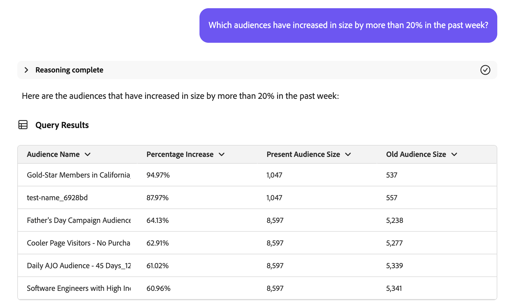

# Audience Agent

>[!AVAILABILITY]
>
>Audience Agent은 AI Assistant에 액세스할 수 있는 모든 고객이 사용할 수 있습니다. 그러나 Audience Agent 기능을 완전히 사용하려면 다음 권한이 필요합니다.
>
>**세그먼트 보기**: 이 권한을 사용하면 Audience Agent을 사용하여 AI Assistant에서 직접 대상자에 대한 인사이트를 볼 수 있습니다.
>
>**세그먼트 관리**: 사용 권한을 부여하려면 Audience Agent을 사용하여 AI Assistant에서 직접 새 대상을 만들 수 있습니다.

Audience Agent을 사용하면 중요한 대상 크기 변경 감지, 중복 대상 감지, 대상 인벤토리 탐색 및 대상 크기 검색을 포함하여 대상에 대한 인사이트를 볼 수 있습니다.

## 지원되는 사용 사례

AI Assistant 내의 Audience Agent은 다음과 같은 사용 사례를 지원합니다.

- 대상자 크기 찾기 및 대상자 크기의 중요한 변경 사항 감지

   - 이를 통해 갑자기 증가하거나 축소된 대상을 찾을 수 있으므로 잠재적 시장 변화를 더 잘 분석할 수 있습니다

- 중복 대상자 감지

   - 이렇게 하면 생성된 대상자와의 중복을 줄일 수 있습니다

- 다음 이름의 전체 또는 부분 속성을 기반으로 대상 찾기

   - 이렇게 하면 대상 인벤토리를 보다 쉽게 탐색할 수 있습니다

- 대상을 정의하는 데 사용할 수 있는 XDM 필드 검색

   - 이 스킬을 사용하면 컨텍스트 및 관련성을 기반으로 대상자에서 사용할 올바른 필드를 보다 쉽게 식별할 수 있습니다

Audience Agent은 다음 기능을 지원하지 않습니다. **현재**

- 지식 기반 대상 만들기

   - 지식 기반 대상 만들기는 주어진 속성 및 이벤트를 기반으로 대상을 만드는 것입니다
   - 또한 대상을 만들기 전에 대상의 잠재적인 크기를 예상할 수 있습니다. 이렇게 하면 활성화 준비가 되기 전에 가장 효과적인 대상을 빠르게 반복할 수 있습니다
   - 이 기능에 대한 지원이 곧 제공됩니다.

- 목표 기반 대상 탐색

   - 목표 기반 대상 탐색을 통해 구매 또는 전환 성향과 같은 머신 러닝 모델을 적용하여 비즈니스 목표에 부합하는 관련 데이터 세트 및 프로필을 검색할 수 있습니다.

또한 Audience Agent을 사용할 때는 다음 제한 사항을 염두에 두어야 합니다.

- Audience Agent에서 데이터를 처리하는 데 최소 24시간이 필요합니다.

   - 예를 들어 지난 24시간 내에 데이터를 찾는 쿼리가 **있을 수 없습니다**. 최소한 지난 48시간 이내에 살펴봐야 합니다.

- Audience Agent은 일괄 처리 세분화를 사용하여 평가되는 **명** 기반 대상만 지원합니다.

## 샘플 프롬프트

다음 예에서는 Audience Agent에 대한 샘플 프롬프트 및 응답을 보여 줍니다.

### 대화 대상자 탐색

부유한 구매자들을 위한 밭을 보여 주세요.

+++ 응답

+++

지난 30일 동안 어떤 대상자가 캠페인에서 활성화되거나 사용되지 않았습니까?

+++ 응답

+++

지난 3개월 동안 새 대상에 매핑된 모든 대상을 나열합니다.

+++ 응답

+++

### 중복 대상자 감지

동일하거나 유사한 설명을 가진 대상이 있습니까?

+++ 응답

+++

규칙이 동일하지만 이름이 다른 대상자를 식별합니다.

+++ 응답

+++

규칙은 동일하지만 활성화 대상이 다른 모든 대상을 표시합니다.

+++ 응답

+++

### 대상 크기 검색

내 대상 &quot;Gold-star Members in California_f153e1&quot;의 현재 크기는 얼마입니까?

+++ 응답

+++

가장 큰 대상은 어디입니까?

+++ 응답

+++

### 대상자 크기의 중요한 변경 사항 감지

지난 주에 20% 이상 증가한 대상은 무엇입니까?

+++ 응답

+++

지난 달에 10% 이상 크기가 감소한 대상은 무엇입니까?

+++ 응답

+++

가장 빠르게 성장하는 대상자는 어디입니까?

+++ 응답

+++

## 다음 단계

이 안내서를 읽고 나면 Audience Agent과 이 안내서가 지원하는 기능을 더 잘 이해할 수 있습니다. Adobe Experience Platform의 에이전트에 대한 자세한 내용은 [Agent Orchestrator 개요](./agent-orchestrator.md)를 참조하십시오.

