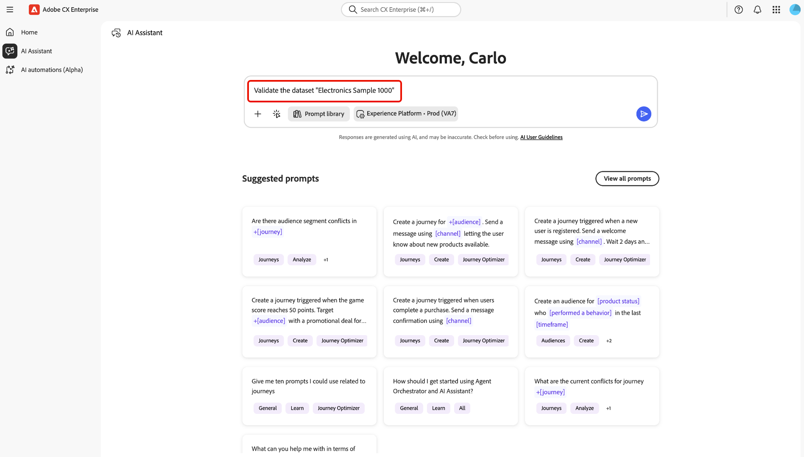

# AI Assistant에서 데이터 유효성 검사

AI Assistant를 사용하여 Adobe Experience Platform 데이터 세트의 데이터 품질을 확인할 수 있습니다. Agent Orchestrator을 기반으로 하는 데이터 유효성 검사 기능은 데이터 세트에 대한 통계 및 시맨틱 유효성 검사를 수행하고, 데이터 세트 필드를 분석하고, 데이터 품질 문제를 식별하고, 실행 가능한 통찰력과 함께 자연어 요약을 반환할 수 있습니다. 데이터 엔지니어, 분석가 및 데이터 관리자는 AI Assistant를 통해 이 기능을 사용하여 SQL 쿼리를 작성하거나 복잡한 스키마 계층을 탐색하지 않고도 신속한 데이터 품질 평가를 수행할 수 있습니다.

AI Assistant의 Agent Orchestrator 기반 데이터 유효성 검사를 사용하여 다음과 같은 작업을 수행할 수 있습니다.

- 온보딩 프로세스와 일상적인 진단 프로세스의 필수 사항을 모두 충족합니다.
- 데이터 세트에 대한 수동 QA를 줄입니다.
- 고객의 가치 실현 시간을 단축합니다.

AI Assistant에서 데이터의 유효성을 검사하는 방법은 이 설명서를 참조하십시오.

>[!NOTE]
>
>AI Assistant는 이 워크플로의 대화 인터페이스입니다. Agent Orchestrator은 추론을 수행하고 검증 단계를 백그라운드에서 조정합니다.

## 사용 사례

| 사용 사례 | 설명 |
| --- | --- |
| 새 구현 | 이러한 시나리오에서는 주요 ID 및 이벤트 필드의 유효성을 검사하여 형식 및 null 비율이 정상인지 확인할 수 있습니다. |
| 매핑 문제 의심 | 이러한 시나리오에서는 필드의 유효성을 검사하고 상위 값 및 무효화를 검사하여 의도한 의미와 일치하는지 확인할 수 있습니다. |
| 지속적인 데이터 관리 | 이러한 시나리오에서는 중요한 데이터 세트에 대해 매주 데이터 세트 유효성 검사를 실행하여 회귀를 조기에 발견할 수 있습니다. |

## UI 안내서

Adobe CX Enterprise의 **AI Assistant**&#x200B;을(를) 사용하여 데이터의 유효성을 검사하십시오. AI Assistant는 대화식 인터페이스이며 Agent Orchestrator은 유효성 검사 워크플로를 백그라운드에서 조정합니다. 다음 단계는 표시되는 기본 화면을 따릅니다.

### 유효성 검사 시작

왼쪽 탐색에서 **[!UICONTROL AI 길잡이]**&#x200B;를 선택합니다. 그런 다음 환경 선택기를 사용하여 데이터 세트가 있는 Experience Platform 조직 또는 샌드박스를 선택합니다(예: **[!UICONTROL Experience Platform - Prod]**). 프롬프트 필드에 유효성 검사 요청(예: 이름별로 데이터 세트 유효성 검사 요청)을 입력합니다. 프롬프트를 제출하려면 **[!UICONTROL 보내기]**&#x200B;를 선택하십시오.

>[!TIP]
>
>AI Assistant에 쿼리를 제출할 때 데이터 세트 이름 앞에 &quot;dataset&quot;이라는 단어를 붙이는 것이 좋습니다. 예를 들어 쿼리는 &quot;Validate Electronics Sample 1000&quot; 대신 &quot;Validate the dataset Electronics Sample 1000&quot;이어야 합니다.

### 데이터 세트 요약 및 필드 테이블 읽기

Agent Orchestrator에서 실행을 완료할 수 있는 짧은 시간을 허용합니다(**추론 완료**). 실행이 완료되면 데이터 세트 이름, 유효성이 확인된 필드 수 및 샘플 크기(일반적으로 최대 약 1,000행)에 대한 요약을 읽습니다.

**[!UICONTROL 필드 요약]**&#x200B;을(를) 사용하여 각 필드의 경로, 형식 및 유효한 값(유효성 표시기 포함)을 검토하십시오. 또한 가능한 경우 카드의 표, 차트 또는 문서 아이콘을 사용하여 결과가 표시되는 방식을 변경할 수 있습니다.

첫 번째 보기 이상의 추가 열 또는 행이 필요한 경우 **[!UICONTROL 모든 결과 표시]**&#x200B;를 선택합니다.

### 분할 보기에서 작업

확장된 보기에서 분할 레이아웃을 사용합니다. 한 쪽에는 세부 통계 및 내러티브가, 다른 쪽에는 차트가 표시됩니다.

- 서술 측면에서 유효성, 고유 값, null 비율, 최상위 고유 값 및 모든 잘못된 값 메시지를 검토하십시오.
- 시각화 측면에서 표본에 있는 유효한 값과 유효하지 않은 값을 빠르게 읽어 보려면 차트를 사용합니다.

**[!UICONTROL 관련 제안]** 또는 맨 아래에 있는 프롬프트 필드를 사용하여 다른 필드의 유효성을 검사하거나, 데이터 집합을 다시 실행하거나, 대화를 계속하십시오.

### 후속 작업에 관련 제안 사용

응답 후 대화 아래에서 **[!UICONTROL 관련 제안]**&#x200B;을(를) 찾으십시오. 제안을 선택하여(예: 동일한 데이터 세트의 특정 필드 유효성 검사) 프롬프트 필드에 로드합니다. 필요한 경우 텍스트를 조정하고 환경을 확인한 다음 **[!UICONTROL 보내기]**&#x200B;를 선택하여 후속 작업을 실행합니다.

### 필드 수준에서 유효성 검사

필드 수준 **[!UICONTROL 유효성 검사 결과]** 카드를 엽니다(예: 단일 필드의 유효성을 검사한 후). 표 대신 시각적 요약을 사용하려면 보기 컨트롤을 사용하여 **차트**(또는 다른 보기)로 전환하십시오. 이 단계에서는 선택적으로 **[!UICONTROL 속성]**&#x200B;을 선택하여 필드에 대한 자세한 내용을 볼 수 있습니다.

해당 필드의 유효성 검사를 더 크고 자세히 보려면 **[!UICONTROL 확장된 보기로 표시]**&#x200B;를 선택하십시오.

확장된 보기를 통해 주어진 필드에 대해 최대 1000개의 레코드 샘플을 기준으로 전체 필드의 항목별 목록을 볼 수 있습니다. 이 기능을 사용하여 유효한 값, 고유한 값 및 null 값에 대한 정보를 검색할 수 있습니다.

## 유효성 검사 작동 방식

AI Assistant에서 유효성 검사를 시작하면 Agent Orchestrator이 전체 데이터 세트 내역을 처리하는 대신 데이터 세트의 대표 샘플(일반적으로 가장 최근 1,000행)을 분석합니다. 이 프로세스는 엄격히 읽기 전용이며 데이터, 스키마 및 매핑이 변경되지 않도록 합니다. 유효성 검사 결과는 소스, 스트리밍, 파일 업로드, 데이터 준비 또는 기타 수집 방법을 통해 데이터가 Experience Platform에 입력되는 방식에 관계없이 일관됩니다. 결과는 데이터 품질 패턴 또는 잠재적 문제를 신속하게 식별하는 데 도움이 되는 지표 검사 역할을 하므로 필요한 경우 추가 조치(예: 쿼리 서비스로 탐색)를 취할 수 있습니다. 이 Agent Orchestrator 기반 접근 방식을 사용하면 데이터 수집을 중단하거나 프로덕션 워크로드에 영향을 주지 않고 신속하게 평가할 수 있습니다.

## 유효성 검사 결과

검증된 모든 필드에 대해 AI Assistant는 다음을 포함하여 검증 워크플로우에서 생성된 결과를 표시합니다.

**기본 통계**

- 샘플에 사용된 총 행 수
- nullCount(및 선택적으로 null %)
- uniqueCount(사용 가능한 경우)
- 상위 고유 값(예: 상위 10) 및 빈도

**의미 체계 유효성 검사**

- **잘못된 값이 의심되는 목록**
- 각 잘못된 값에 대해 **설명**(예: &quot;올바른 전자 메일 형식이 아님&quot;, &quot;타임스탬프가 예상 범위를 벗어남&quot;)이

**자연어 요약**

- 필드 품질에 대한 간단한 서술 요약
- &quot;필드 X에 대한 매핑 검토&quot;, &quot;높은 null 비율로 인해 필드 Y를 삭제하는 것 고려&quot; 또는 &quot;이메일 형식에 대한 유효성 검사 강화&quot;와 같은 다음 작업을 제안했습니다.

| Aspect | 출력 예 |
| --- | --- |
| 완성도 | `nullCount = 9,532 (95.3%)` |
| 고유성 | `uniqueCount = 3` |
| 상위 값 | `"True" (255), "False" (243)` |
| 초기값 | `"abc@, reason: "not a valid email address"` |

## 유효성 검사 유형

AI Assistant를 사용하여 수행할 수 있는 유효성 검사 유형에는 두 가지가 있습니다.

- **필드 유효성 검사**: 데이터 집합에 있는 특정 필드의 유효성을 검사합니다.
- **데이터 집합 유효성 검사**: 데이터 집합에서 최대 5개의 필드 유효성 검사

>[!BEGINTABS]

>[!TAB 필드 유효성 검사]

AI Assistant의 필드 유효성 검사를 사용하여 주어진 데이터 세트에서 특정 필드의 유효성을 검사합니다. 이 유효성 검사 스킬은 다음을 제공합니다.

- Null 수 및 고유 값 수.
- 상위 고유 값 및 해당 빈도.
- AI 지원 의미 유효성 검사(사용 가능한 메타데이터와 데이터의 실제 값을 기반으로 잘못된 값을 감지하는 기능).

필드 유효성 검사에 대한 예제 프롬프트는 다음과 같습니다.

- Customers_2024 데이터 세트에서 이메일 필드의 유효성을 검사합니다.
- customer_events_2024 데이터 세트의 필드 상태를 확인합니다.
- 고객 데이터 데이터 세트에 대한 field person.address.city 의 유효성을 검사합니다.

>[!TAB 데이터 집합 유효성 검사]

AI Assistant의 데이터 세트 유효성 검사를 사용하여 전체 데이터 세트의 유효성을 검사하여 전반적인 품질 및 주요 문제를 요약합니다. 이러한 필드를 명시적으로 제공할 수 있지만 Agent Orchestrator은 데이터 세트를 분석하고 가장 관련성이 높은 필드를 자동으로 결정할 수도 있습니다. 이 스킬은 필드 유효성 검사와 동일한 유형의 정보를 제공하지만 여러 타겟팅된 필드에 걸쳐 정보를 제공합니다. 주어진 데이터 세트에서 최대 5개의 필드를 검증할 수 있습니다.

데이터 세트 유효성 검사에 대한 예제 프롬프트는 다음과 같습니다.

- 고객 데이터 2024 데이터 세트의 유효성을 검사합니다.
- 필드의 유효성 검사 이메일, Customers_2024용 전화.
- 고객 데이터에 대한 firstName, lastName, birthDate를 요약합니다.
- 데이터 세트 693012a4b8c98b09cea350bc를 요약합니다.

>[!ENDTABS]

## 데이터 유효성 검사로 수행한 검사

각 필드 및 데이터 세트에 대해 다음 유형의 유효성 검사가 수행됩니다.

- **완전성 확인**: null/누락 개수 및 백분율.
- **배포 확인**: 상위 고유 값과 해당 배포, 카디널리티가 높은 검색.
- **의미 체계 검사와 스키마 비교**: XDM 필드 이름, 유형 및 설명을 사용하여 &quot;유효한&quot; 모양을 유추한 다음 예외 항목에 플래그를 지정합니다.
- **데이터 형식 인식 검사**(해당되는 경우):
   - 이메일: 형식 및 도메인 타당성
   - 전화: 형식 준비(예: E.164)
   - 날짜/타임스탬프: 기본 형식 온전성(예: ISO-8601)
- **ID 관련 검사**(향후/확장): 후보 ID 필드 또는 복합 키의 고유성입니다.

이러한 검사는 결정론적 통계를 LLM 지원 의미론적 유효성 검사와 결합하여 스키마와 기술적으로 일치하는 경우에도 &quot;잘못된 것처럼 보이는&quot; 값을 감지합니다.

## 제한 사항

데이터를 확인하기 전에 몇 가지 주요 제한 사항을 알아두는 것이 중요합니다. 이러한 제한 사항은 성능과 기능의 균형을 유지하기 위한 것으로, 사용자가 예상할 수 있는 분석 및 통찰력 유형에 대한 기대를 설정하는 데 도움이 됩니다.

- **샘플링만**: 유효성 검사는 전체 데이터 세트를 처리하는 대신 데이터 세트 샘플(일반적으로 마지막 ~1,000행)에서 작동합니다. 전체 데이터 세트 검색을 사용할 수 없습니다.
- **필드 개수 제한**: 데이터 집합의 유효성을 검사할 때 에이전트는 요청당 최대 5개의 필드를 분석합니다. 이러한 필드를 지정하거나 에이전트가 자동으로 선택하도록 할 수 있습니다.
- **확률적 의미 체계**: 잘못된 값을 검색하면 LLM 기반 추론이 부분적으로 필요하며, 이는 간혹 미묘한 오류나 플래그 경계 값을 놓칠 수 있습니다.
- **읽기 전용 작업**: 에이전트가 데이터 또는 해당 스키마를 변경하지 않습니다. 통찰력을 제공하고 잠재적 문제를 강조하지만 자동화된 수정 작업은 수행하지 않습니다.

유효성 검사 요구 사항이 보다 포괄적이거나 복잡한 비즈니스 논리를 적용해야 하는 경우 쿼리 서비스 또는 데이터 준비 유효성 검사와 같은 추가 도구를 사용하여 AI Assistant에 표시된 결과를 보완하는 것이 좋습니다.
