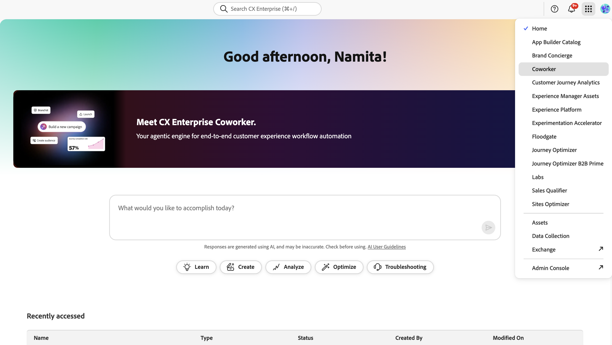

# CX Enterprise Coworker 평가판

>[!AVAILABILITY]
>
>특정 적격 CX 엔터프라이즈 고객은 구매 약속을 이행하기 전에 자신의 환경에서 Adobe의 아젠틱 AI 오퍼링의 가치를 경험하기 위해 사용량 제한 평가판에 액세스할 수 있습니다.

Adobe의 재량에 따라 체험판의 고객은 AI Assistant 대화 환경의 발전인 **동료 채팅**&#x200B;에 액세스할 수 있습니다. Coworker Chat을 사용하면 팀이 자연어를 통해 CXO 제품 작업을 자동화할 수 있으며 유연한 계획, 사용자 정의 기술 및 지능형 실행을 통해 아이디어를 신속하게 작업으로 전환할 수 있습니다.

자격이 있는 모든 고객은 순차적으로 AI Assistant 및 Adobe Experience Platform 에이전트에서 동료 채팅으로 전환됩니다. 당분간은 특정 고객이 동료 채팅이 활성화될 때까지 AI Assistant 및 Experience Platform 에이전트에 대한 액세스 권한을 보유할 수 있습니다. 동료 캠페인은 이 평가판에 포함되지 않습니다.

**AI Assistant**: Agent Orchestrator에서 제공하는 전체 페이지, 몰입형 대화 인터페이스로서 제품 간에 작동하며, 이를 통해 실무자는 활성화된 Experience Cloud 제품을 사용하여 GenAI 및 Agentic AI 기능을 활용할 수 있습니다. 자세한 내용은 [AI 어시스턴트 UI 안내서](../ai-assistant/ai-assistant-ui.md)를 참조하십시오.

**Adobe Experience Platform 에이전트**: 고객 경험 도메인 범주에서 공통 작업을 제공하는 데 능숙한 특수 목적 AI 에이전트입니다. 에이전트를 활용하여 더 빠르고 효과적으로 경험을 생성하고 제공할 수 있는 역량을 확장하여 다음 수준의 생산성과 효율성을 높일 수 있습니다. 각 Experience Cloud 애플리케이션에서 에이전트를 활용할 수 있는 사항을 이해하려면 [Experience Cloud의 에이전트 AI](https://experienceleague.adobe.com/ko/docs/core-services/interface/features/agentic-ai)에 대한 설명서를 참조하십시오.

## 체험판 프로그램 세부 정보

평가판에 대한 고객 적격성은 완전히 Adobe의 재량에 달려 있습니다. Experience Platform Agents AI 크레딧이 있거나 라이선스가 있었던 고객은 평가판을 사용할 수 없습니다.

적격 고객은 다음에 사용할 최대 10,000개의 AI 크레딧에 대한 최초 1회 자격을 받습니다.

- 동료 채팅: 동료 채팅에 입력된 입력입니다. 제한된 입문 기간 동안 투입물은 투입물 당 25개의 AI 크레딧의 비율로 AI 크레딧을 소비합니다. 이 요금은 제한된 시간 동안만 사용할 수 있으며 변경될 수 있습니다.
- Experience Platform 에이전트: [AI 신용 소비 테이블](https://experienceleague.adobe.com/ko/docs/core-services/interface/features/ai-credit-consumption)에 나열된 Experience Platform 에이전트(CX 엔터프라이즈 애플리케이션에 대한 기존 라이선스에 따라 다름)를 사용하여 수행되는 모든 작업 조합입니다.

Adobe Experience Platform UI의 라이선스 사용 대시보드를 사용하여 AI 크레딧을 추적할 수 있습니다. 자세한 내용은 [라이선스 사용 대시보드 설명서](https://experienceleague.adobe.com/en/docs/experience-platform/dashboards/guides/license-usage)를 참조하세요.

Agentic AI 모니터링 대시보드는 조직 전체에서 Agentic AI가 채택되고 사용되는 방식을 명확하게 볼 수 있도록 합니다. 승인된 사용자는 참여를 쉽게 추적하고, 피드백을 수집하고, AI 크레딧 사용을 모니터링하고, 주요 지표를 검토할 수 있습니다. 이러한 통찰력을 사용하여 최적화 기회를 포착하고 거버넌스 및 채택 노력을 지원합니다. 자세한 내용은 [Agentic AI 사용 모니터링 안내서](https://experienceleague.adobe.com/ko/docs/core-services/interface/features/monitoring)를 참조하세요.

>[!IMPORTANT]
>
>- 고객이 초기 할당량인 10,000개의 AI 크레딧을 소비하거나 추가 AI 크레딧에 대한 라이센스를 별도로 구매하면 평가판이 종료됩니다. AI 크레딧은 평가판 경험 기간 동안만 존재하며 고객이 10,000개의 AI 크레딧 평가판 할당을 모두 사용하기 전에 추가 AI 크레딧을 구매하는 경우 롤오버되지 않습니다.  고객은 즉시 액세스 권한을 상실하거나 초과 사용에 대한 요금이 부과되지 않을 수 있지만, 이러한 혜택의 연장은 Adobe의 재량에 달려 있으며, 고객은 중단 없이 동료 채팅(또는 Adobe Experience Platform 에이전트)을 계속 사용하려면 체험판이 완료되는 즉시 추가 AI 크레딧을 구매해야 합니다.
>
>- Adobe은 언제든지 어떤 이유로든 공동 작업자 채팅(또는 Adobe Experience Platform 에이전트)에 대한 고객의 액세스를 일시 중단하거나 종료할 수 있는 권한을 보유합니다. Adobe은 언제든지 재량에 따라 재판을 취소하거나 변경할 수 있습니다.

## 액세스 안내서

### 동료 채팅 액세스

적격 고객의 사용자는 평가판의 일부로 동료 채팅에 대한 기본 액세스 권한을 갖게 되므로 조치가 필요하지 않습니다. 동료 채팅은 사용자 지침 및 감독에 따라 작동하며 조직의 기존 제품 수준 액세스 제어를 따릅니다. 사용자는 조직의 기본 CX Enterprise 제품 내에서 이미 허용되는 작업만 수행할 수 있습니다.

사용자는 CX Enterprise의 상단 헤더에 있는 애플리케이션 선택기에서 Coworker를 선택하여 액세스할 수 있습니다.

고객이 조직의 **동료 채팅** 액세스를 취소하거나 **AI Assistant** 및 **Experience Platform 에이전트**(으)로 되돌리려면 [cx-coworker-questions@adobe.com](mailto:cx-coworker-questions@adobe.com)에 요청을 보내십시오.

동료 채팅으로 전환되지 않은 고객의 경우:

### Agent Orchestrator에서 제공하는 AI Assistant를 통해 Experience Platform 에이전트 액세스

적격 고객의 사용자는 평가판의 일부로 AI Assistant 및 에이전트에 대한 기본 액세스 권한을 갖게 되므로 별도의 조치가 필요하지 않습니다. Experience Platform 에이전트는 사용자 입력 및 감독에 의해 안내됩니다. 또한 에이전트는 이전에 정의된 제품 수준 액세스 제어를 준수하므로, 사용자는 해당 기본 CX 엔터프라이즈 제품 내에서 권한이 있는 작업만 수행하거나 작업을 실행할 수 있습니다.

액세스 권한이 있으면 Adobe Experience Cloud 홈 페이지로 이동하여 AI 지원을 시작합니다. [검색 프롬프트](../ai-assistant/ai-assistant-ui.md#discovery-prompts)를 사용하여 프롬프트 및 일반 워크플로우에 대한 제안을 볼 수 있습니다. 이 기능을 사용하면 AI Assistant를 사용하여 온보딩을 가속화할 수 있습니다. 또한 다른 에이전트에서 사용할 수 있는 다양한 프롬프트에 대해서는 [프롬프트 라이브러리](../ai-assistant/prompt-library.md)를 읽어 보십시오. 자세한 내용은 [AI Assistant UI 안내서](../ai-assistant/ai-assistant-ui.md)를 참조하십시오.

고객이 이러한 에이전트 기능에 대한 액세스를 거부하고 체험판 액세스를 사용하지 않도록 설정하려면 [cx-coworker-questions@adobe.com](mailto:cx-coworker-questions@adobe.com)에 요청을 보내십시오.

## 추가 리소스

Coworker, Agent Orchestrator 및 AI Assistant에 대한 자세한 내용은 다음 안내서를 참조하십시오.

- [CX Enterprise Coworker](https://experienceleague.adobe.com/en/docs/cx-enterprise-coworker/content/home)
- [Agent Orchestrator 개요](agent-orchestrator.md)
- [AI Assistant UI 안내서](../ai-assistant/ai-assistant-ui.md)
- [AI Assistant 프롬프트 라이브러리](../ai-assistant/prompt-library.md)
- [Experience Cloud의 AI](../home.md)

## 자주 묻는 질문 {#faq}

Experience Platform 에이전트 평가판에 대한 FAQ에 대한 답변은 다음을 참조하십시오.

### Adobe Experience Platform 에이전트 재판이란 무엇입니까?

Agentic 사용 제한 평가판을 사용하면 적격 고객이 최대 10,000개의 AI 크레딧을 추가 비용 없이 동료 채팅(또는 Experience Platform 에이전트 선택)을 사용할 수 있습니다. 목표는 고객이 상업적인 결정을 내리기 전에 이러한 에이전트로부터 가치를 경험하기 위한 낮은 마찰, 낮은 위험 경로를 제공하는 것입니다.

### 이 체험판에는 어떤 에이전트가 포함됩니까?

평가판에 포함된 에이전트의 전체 목록을 보려면 [Experience Cloud의 Agentic AI](https://experienceleague.adobe.com/ko/docs/core-services/interface/features/agentic-ai)에 대한 안내서를 읽어 보십시오.

### 누가 이 재판에 참여할 수 있습니까?

평가판은 Adobe에서 적절한 지원을 제공할 수 있도록 단계적으로 특정 적격 Adobe Experience Cloud 고객에게 배포되고 있습니다. 참여에 관심이 있는 경우 Adobe 계정 팀에 연락하여 상태를 확인하고 액세스 옵션에 대해 논의할 수 있습니다.

### AI 크레딧은 얼마나 받아야 하며 해당 AI 크레딧이 사용될 때 어떻게 됩니까?

적격 고객은 평가판에 대해 최대 10,000개의 AI 크레딧을 받으며, 이는 동료 채팅(또는 Experience Platform 에이전트)이 작업을 실행할 때 사용됩니다. 이러한 AI 크레딧은 체험판 활동 기간 동안만 존재하며 전체 10,000개의 AI 크레딧을 사용하기 전에 추가 AI 크레딧에 라이선스를 부여하는 경우 롤오버되지 않습니다. AI 신용 사용에 대한 자세한 내용은 [에이전트 작업 및 AI 신용 사용 안내서](https://experienceleague.adobe.com/ko/docs/core-services/interface/features/ai-credit-consumption)를 참조하십시오.

### 이거 값이 좀 나옵니까?

이 평가판에는 추가 구매가 필요하지 않습니다. 유료 오퍼로의 자동 전환은 없습니다. 고객이 체험판을 넘어 동료 채팅(또는 Experience Platform 에이전트)을 계속 사용하기로 결정하면 Adobe 계정 팀은 고객과 협력하여 유료 서비스로 전환합니다.

### 누가 어떻게 사용법을 볼 수 있습니까?

Adobe Experience Platform UI의 라이선스 사용 대시보드를 사용하여 AI 크레딧을 추적할 수 있습니다. 자세한 내용은 [라이선스 사용 대시보드 설명서](https://experienceleague.adobe.com/en/docs/experience-platform/dashboards/guides/license-usage)를 참조하세요. 대시보드를 사용하여 AI 크레딧 사용 및 보고를 봅니다. 적절한 권한이 있는 관리자 및 사용자만 사용 정보를 볼 수 있습니다.

고객은 사용 및 보고를 볼 수 있는 사용자를 계속 제어합니다. 적절한 권한이 있는 관리자 및 사용자만 이 정보를 볼 수 있습니다.

### 재판이 끝나면 어떻게 되나요?

최대 10,000개의 AI 크레딧에 대한 초기 일회성 권한을 사용하거나 추가 AI 크레딧에 라이선스를 부여하면 평가판이 종료됩니다.

체험판이 종료되면 다음을 선택할 수 있습니다.

- 앞으로 이동 안 함
   - 체험판 액세스가 만료됩니다.
   - 기존 Adobe 제품은 평가판을 전환하지 않아 페널티 없이 이전처럼 계속 작동합니다
- 지속적인 동료 채팅(또는 Experience Platform 에이전트) 사용
   - Adobe 계정 팀과 협력하여 유료 서비스로 전환할 수 있습니다.

체험판이 종료된 고객을 유료 고객으로 전환할 수 있는 자동 숨겨진 스위치가 없습니다.
