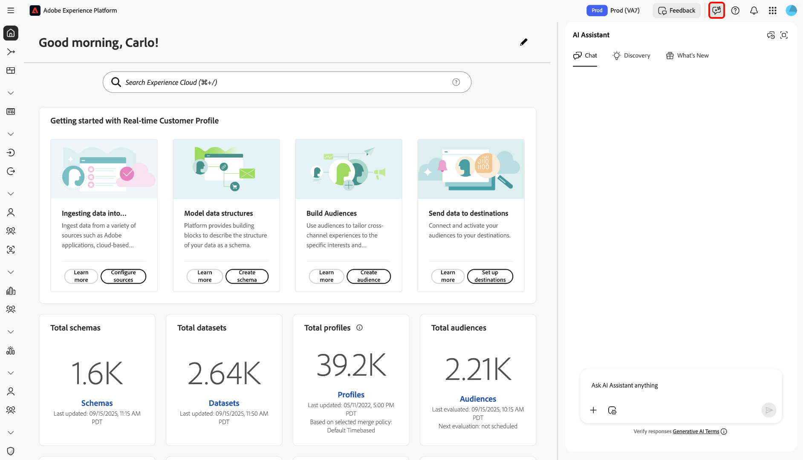
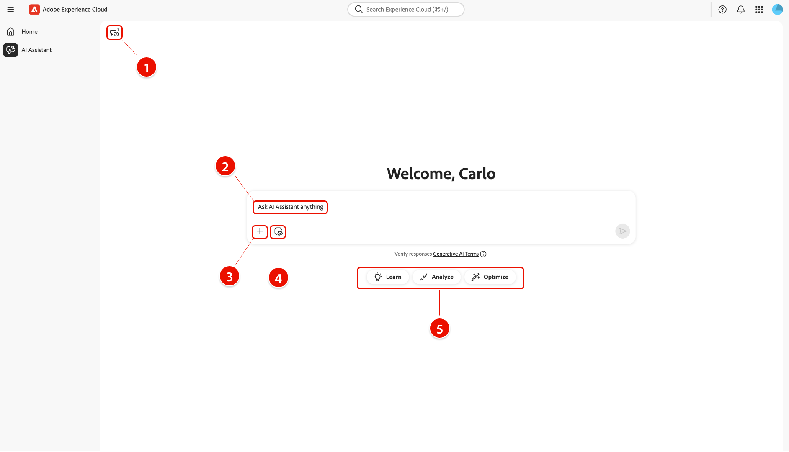
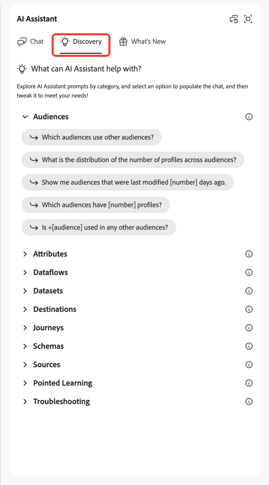
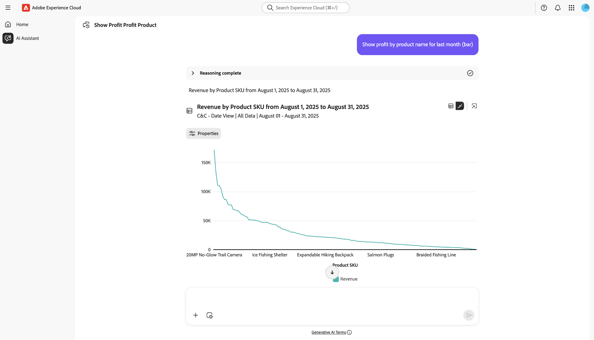

# AI Assistant

AI Assistant는 Adobe Experience Platform 기반 애플리케이션에서 생산성을 높이고 작업을 재정의할 수 있는 지능형 대화식 생성 AI 도구입니다. AI Assistant를 사용하여 Adobe Experience Platform 에이전트 및 기타 AI 기능에 액세스할 수 있습니다.

AI Assistant를 사용하는 방법을 알려면 이 안내서를 참조하십시오.

## AI Assistant 액세스

AI Assistant에 액세스하는 방법에는 여러 가지가 있습니다.

Experience Cloud 홈 인터페이스의 왼쪽 탐색에서 **[!UICONTROL AI Assistant]**&#x200B;을(를) 선택하여 AI Assistant의 전체 화면 보기를 시작합니다.

+++보려면 선택

+++

Experience Platform, Adobe Journey Optimizer 및 Customer Journey Analytics과 같은 Experience Cloud 애플리케이션의 홈페이지에서 AI Assistant를 실행할 수도 있습니다. 제품 홈 페이지로 이동한 다음 상단 헤더에서 **AI Assistant 아이콘**&#x200B;을 선택하여 오른쪽 레일에서 AI Assistant 채팅 패널을 시작합니다.

+++보려면 선택

+++

## AI Assistant 사용자 인터페이스 탐색

이 섹션을 읽고 AI Assistant 인터페이스를 탐색하는 방법을 알아보십시오.

### 전체 화면 보기

AI Assistant 인터페이스에는 사용자가 효과적으로 상호 작용하는 데 도움이 되는 몇 가지 주요 요소가 포함되어 있습니다.

1. **[!UICONTROL 대화]**: **[!UICONTROL 대화]** 아이콘을 선택하여 새 대화를 시작하고 대화 내역에서 최근 대화에 액세스합니다. 자세한 내용은 [대화](#conversations)의 섹션을 참조하세요.
2. **입력란**: 입력란을 선택하여 AI Assistant에 대한 질문 및 프롬프트를 입력합니다. 자세한 내용은 [입력 기능](#input-features)에 대한 섹션을 참조하십시오.
3. **데이터 및 개체 자동 완성**: - 데이터 및 개체 제안 및 자동 완성을 사용하려면 더하기 아이콘을 선택합니다. 선택한 경우 팝업 창을 사용하여 제안된 엔티티를 선택할 수 있습니다. 자세한 내용은 [데이터 및 개체 자동 완성](#autocomplete)에 대한 섹션을 참조하십시오.
4. **컨텍스트 설정**: - 컨텍스트 설정 아이콘을 선택하여 AI Assistant에 대한 정보 소스를 구성합니다. 이 도구를 사용하여 AI Assistant가 쿼리에 응답하기 위해 참조하는 애플리케이션, 샌드박스 및 데이터 보기를 구성할 수 있습니다. 자세한 내용은 [컨텍스트 설정](#context-setting)에 대한 섹션을 참조하십시오.
5. **검색**: - 시작하는 데 사용할 수 있는 샘플 쿼리를 보려면 **[!UICONTROL 학습]**, **[!UICONTROL 분석]** 및 **[!UICONTROL 최적화]**&#x200B;를 선택하십시오. 자세한 내용은 [검색 기능 프롬프트](#discoverability-prompts)의 섹션을 참조하십시오.

### 레일 보기

레일 보기를 사용하면 간단한 패널에서 채팅, 검색 프롬프트, 업데이트, 대화 및 인터페이스 컨트롤에 빠르게 액세스할 수 있습니다.

1. **[!UICONTROL 채팅]**: 인터페이스에서 다른 요소에 액세스하도록 나간 경우 대화로 돌아가려면 헤더에서 **[!UICONTROL 채팅]**&#x200B;을(를) 선택하십시오.
1. **[!UICONTROL 검색]**: 범주별로 구성된 AI Assistant 프롬프트 목록을 보려면 **[!UICONTROL 검색]**&#x200B;을(를) 선택하십시오. 이러한 사전 구성된 프롬프트를 사용하여 채팅을 채울 수 있습니다. 또한 특정 사용 사례를 충족하도록 제안된 프롬프트를 조정할 수 있습니다.
1. **[!UICONTROL 새로운 기능]**: AI Assistant에서 사용할 수 있는 최신 업데이트 목록을 보려면 **[!UICONTROL 새로운 기능]**&#x200B;을 선택하십시오.
1. **[!UICONTROL 대화]**: **[!UICONTROL 대화]** 아이콘을 선택하여 새 대화를 시작하고 대화 내역에서 최근 대화에 액세스합니다. 자세한 내용은 [대화](#conversations)의 섹션을 참조하세요.
1. **전체 화면 보기**: **[!UICONTROL 전체 화면 보기]** 아이콘을 선택하여 AI Assistant 인터페이스를 오른쪽 레일에서 전체 화면 모드로 변경합니다.
1. **데이터 및 개체 자동 완성**: 데이터 및 개체 제안 및 자동 완성을 사용하려면 더하기 아이콘을 선택하십시오. 선택한 경우 팝업 창을 사용하여 제안된 엔티티를 선택할 수 있습니다. 자세한 내용은 [데이터 및 개체 자동 완성](#autocomplete)에 대한 섹션을 참조하십시오.
1. **컨텍스트 설정**: 컨텍스트 설정 아이콘을 선택하여 AI Assistant에 대한 정보 소스를 구성합니다. 이 도구를 사용하여 AI Assistant가 쿼리에 응답하기 위해 참조하는 애플리케이션, 샌드박스 및 데이터 보기를 구성할 수 있습니다. 자세한 내용은 [컨텍스트 설정](#context-setting)에 대한 섹션을 참조하십시오.

## AI Assistant UI 안내서

이 섹션에서는 AI Assistant 사용자 인터페이스의 주요 기능 및 탐색 옵션에 대한 개요를 제공합니다. AI 어시스턴트에 액세스하는 방법을 설명하고, 전체 화면과 레일 보기 모두에서 레이아웃과 컨트롤을 설명하며, 대화, 입력 기능, 자동 완성, 컨텍스트 설정, 검색 프롬프트 등의 주요 도구를 소개합니다. 다음 섹션에서는 이러한 기능을 사용하여 AI Assistant와 상호 작용하고 경험을 최대한 활용하는 방법에 대한 자세한 지침을 제공합니다.

### 검색 프롬프트

AI Assistant의 검색 기능을 사용하여 AI Assistant가 지원하는 엔티티로 그룹화된 일반 주제 목록을 볼 수 있습니다. 시작 지점에 따라 검색 프롬프트가 다릅니다.

>[!BEGINTABS]

>[!TAB 전체 화면 보기에서 검색 사용]

전체 화면 보기에서 검색 프롬프트는 **[!UICONTROL 학습]**, **[!UICONTROL 분석]** 및 **[!UICONTROL 최적화]** 범주로 그룹화됩니다.

검색 프롬프트를 사용하여 제품 지식을 향상시키려면 **[!UICONTROL 학습]**&#x200B;을 선택한 다음 나타나는 드롭다운 창에서 프롬프트를 선택하십시오.

>[!TAB 레일 보기에서 검색 사용]

레일 보기에서 **[!UICONTROL 검색]**&#x200B;을 선택하여 AI Assistant를 사용하여 채팅을 시작하고 채우는 데 사용할 수 있는 광범위한 검색 프롬프트 목록에 액세스합니다.

>[!ENDTABS]

입력 상자를 채울 프롬프트를 선택합니다. 여기에서 특정 사용 사례에 맞게 프롬프트를 편집할 수 있습니다. 준비가 되면 오른쪽에 있는 전송 아이콘을 선택하여 쿼리를 제출합니다.

## 응답과 상호 작용

### 추론 프로세스 확인 {#reasoning}

그런 다음 AI Assistant는 기술 자료를 쿼리하고 답을 계산합니다. 잠시 후 AI 비서가 추론 프로세스, 관련 제안, 정보 소스 및 피드백 도구를 자세히 분석하는 옵션을 포함한 답변을 반환합니다.

기본 추론 프로세스를 더 잘 이해하려면 **[!UICONTROL 추론 완료]**&#x200B;를 선택하세요.

*[!UICONTROL 추론 완료]* 창이 확장되어 요청 요약과 응답을 만든 방법에 대한 세부 정보가 표시됩니다.

### 관련 제안 사용

그런 다음 응답 맨 아래로 이동하여 **[!UICONTROL 관련 제안]**&#x200B;을(를) 선택하여 초기 쿼리와 관련된 프롬프트 목록을 받습니다. 이러한 프롬프트를 사용하여 AI Assistant와 대화를 계속할 수 있습니다.

### 소스 보기

AI Assistant의 응답을 확인하려면 **[!UICONTROL 소스]**&#x200B;를 선택하여 AI Assistant가 응답을 계산할 때 참조한 정보 소스 목록을 확인합니다.

### 피드백 제공

답변이 제공된 옵션을 사용하여 AI Assistant에서 사용자 경험에 대한 피드백을 제공할 수 있습니다.

피드백을 제공하려면 AI Assistant의 응답을 받은 후 엄지 손가락을 위로 또는 아래로 선택한 다음 제공된 텍스트 상자에 피드백을 입력합니다.

>[!BEGINTABS]

>[!TAB 엄지손가락 위로]

긍정적인 피드백을 제공하려면 **[!UICONTROL 엄지손가락 위로]**&#x200B;를 선택하세요. 선택적으로 긍정적인 피드백 목록에서 선택하거나 입력 상자를 사용하여 특정 피드백을 입력할 수 있습니다.

+++보려면 선택

**[!UICONTROL 자세한 피드백]**&#x200B;을 선택하여 피드백을 자세히 알아볼 수도 있습니다. 완료되면 **[!UICONTROL 제출]**&#x200B;을 선택하세요.

+++

>[!TAB 엄지 손가락 아래로]

건설적인 피드백을 제공하려면 **[!UICONTROL 엄지손가락을 아래로]**&#x200B;하세요. 건설적인 피드백 목록에서 선택하거나 입력 상자를 사용하여 특정 피드백을 입력할 수 있습니다.

+++보려면 선택

마찬가지로 **[!UICONTROL 자세한 피드백]**&#x200B;을 선택하여 피드백을 자세히 설명할 수도 있습니다. 완료되면 **[!UICONTROL 제출]**&#x200B;을 선택하세요.

+++

>[!ENDTABS]

### 분할 뷰 기능 사용

AI Assistant 응답에 이미지가 포함된 경우 경로 아이콘을 선택하여 분할 보기 모드를 실행할 수 있습니다. 이렇게 하면 오른쪽에 표시된 컨텍스트 이미지를 통해 AI Assistant의 전체 응답을 읽을 수 있습니다.

### 대화

*[!UICONTROL 모든 대화]* 패널을 사용하여 AI Assistant와의 대화를 재설정하고 다시 방문할 수 있습니다. **[!UICONTROL 모든 대화]** 창을 보려면 *[!UICONTROL 대화]* 아이콘을 선택하십시오.

이전 대화를 다시 방문하려면 제공된 목록에서 대화 주제를 선택합니다.

새 대화를 시작하려면 **[!UICONTROL 새 대화]**&#x200B;를 선택하세요.

### 컨텍스트 설정 {#context-setting}

AI Assistant의 컨텍스트 설정 기능을 사용하여 AI Assistant가 쿼리에 응답하기 위해 참조하는 **application**, **sandbox**, **dataview**&#x200B;를 구성합니다. 컨텍스트 설정에 액세스하려면 입력란에서 **[!UICONTROL 컨텍스트 설정]** 아이콘을 선택하십시오.

*[!UICONTROL 다음에서 응답...]* 팝업 창이 나타납니다. 이 창을 사용하여 사용할 정보 원본을 구성한 다음 **[!UICONTROL 컨텍스트 설정]**&#x200B;을 선택합니다.

| 정보 소스 | 설명 | 예 |
| --- | --- | --- |
| 앱 | 쿼리와 관련된 Experience Cloud 애플리케이션. | Experience Platform, Journey Optimizer, Customer Journey Analytics 등 |
| 샌드박스 | 쿼리와 관련된 데이터 세트 또는 정보가 포함된 샌드박스. | 프로덕션(VA7), 개발 |
| 데이터 보기 | Customer Journey Analytics에서 AI Assistant를 사용할 때 데이터 보기 설정은 Data Insights Agent이 다음을 이해하는 데 도움이 됩니다. <ul><li>쿼리할 데이터 세트</li><li>사용 가능한 데이터 구성 요소</li><li>데이터에 대한 응답을 구성하는 방법</li><li>Analysis Workspace에서 만들 시각화</li></ul> |

### 데이터 및 개체 자동 완성

자동 완성 기능을 사용하여 샌드박스에 있는 데이터 객체 목록을 수신할 수 있습니다. 자동 완성을 사용하려면 쿼리에 더하기 아이콘(+)을 입력합니다. 또는 텍스트 입력 상자 하단에 있는 더하기 아이콘(+)을 선택할 수도 있습니다. 샌드박스의 권장 데이터 개체 목록이 표시된 창이 나타납니다.

### 응답 확인

AI 어시스턴트에서 응답을 확인하는 방법은 여러 가지가 있습니다. **[!UICONTROL 개체에 일치하는 검색어]**&#x200B;을(를) 선택하여 조직의 특정 개체에 일치하는 검색어 요약을 확인합니다.

**[!UICONTROL 결과를 얻은 방법]**&#x200B;을 선택하여 AI Assistant가 어떻게 해답을 얻었는지에 대한 자세한 단계별 설명을 확인합니다. 또한 질문에 답변하기 위해 실행된 SQL 쿼리를 볼 수도 있습니다. 이 쿼리는 읽기 전용이며 쿼리 서비스에서 사용할 수 없습니다.

### 데이터 시각화 구성

AI Assistant의 데이터 시각화 기능을 사용하여 데이터를 더 잘 이해할 수 있습니다. 쿼리에 사용할 그래프 유형을 지정할 수도 있습니다. 예를 들어, **&quot;지난 달(막대)의 제품 이름별 이익 표시&quot;**&#x200B;라는 쿼리를 제출하여 제품 이름별로 구성된 지난 달의 이익 막대 그래프를 받습니다.

그런 다음 **[!UICONTROL 속성]**&#x200B;을 선택하여 그래프 유형을 변경하고 X축과 Y축에 대한 값을 구성합니다.

AI Assistant는 데이터 시각화에 대해 여러 그래프 유형을 지원합니다. 데이터 위로 마우스를 가져가면 모든 유형의 그래프와 상호 작용할 수 있습니다.

>[!BEGINTABS]

>[!TAB 줄]

선 그래프를 보려면 **[!UICONTROL 속성]**&#x200B;을 선택한 다음 **[!UICONTROL 선]**&#x200B;을 선택하십시오.

>[!TAB 영역]

영역 그래프를 보려면 **[!UICONTROL 속성]**&#x200B;을 선택한 다음 **[!UICONTROL 영역]**&#x200B;을 선택하십시오.

>[!TAB 분산]

분산 그래프를 보려면 **[!UICONTROL 속성]**&#x200B;을 선택한 다음 **[!UICONTROL 분산]**&#x200B;을 선택하십시오.

>[!TAB 도넛]

도넛 그래프를 보려면 **[!UICONTROL 속성]**&#x200B;을 선택한 다음 **[!UICONTROL 도넛]**&#x200B;을 선택하십시오.

>[!ENDTABS]
